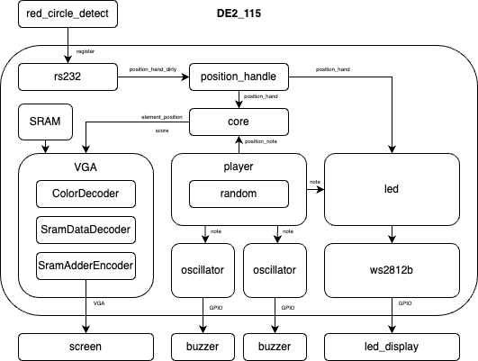

# Music interatice games

# Overview

A music interatice games project, please read "team02_final_presentation.pdf" to understand our detail.

We realize:
(1) 900*1600 VGA Display 
(2) rs232 comunicating 
(3) hand detection (by red points) 
(4) bluzzer and led control 

# Project Overview

This project consists of various modules and files organized into different directories. Below is a brief description of each directory and its contents:

## System Architecture

The system architecture is depicted in the following diagram:


 
## Directory Structure
```
.
├── README.md
├── VGA
│   ├── vga.sv
│   └── vga_sram.sv
├── requirements.txt
├── src
│   ├── README.md
│   ├── SRAM
│   │   ├── ColorDecoder.sv
│   │   ├── SramAddrEncoder.sv
│   │   └── SramDataDecoder.sv
│   ├── core.sv
│   ├── img
│   │   ├── circle.png
│   │   ├── circle.sv
│   │   ├── circle1.sv
│   │   ├── circle2.sv
│   │   ├── circle3.sv
│   │   ├── number
│   │   │   ├── 0.sv
│   │   │   ├── 1.sv
│   │   │   ├── 2.sv
│   │   │   ├── 3.sv
│   │   │   ├── 4.sv
│   │   │   ├── 5.sv
│   │   │   ├── 6.sv
│   │   │   ├── 7.sv
│   │   │   ├── 8.sv
│   │   │   └── 9.sv
│   │   └── score.sv
│   ├── led
│   │   ├── led.v
│   │   ├── oscillator.v
│   │   ├── player.v
│   │   ├── tb_ws2812b.v
│   │   └── ws2812b.v
│   ├── red-circle-detection.py
│   ├── rs232_qsys
│   │   └── synthesis
│   │       ├── rs232.v
│   │       └── submodules
│   │           └── RS232_wrapper.sv
│   ├── rsa_qsys.qip
│   ├── rsa_qsys.v
│   └── vga_sram.sv
└── utils
    ├── image_converter
    │   ├── README.md
    │   ├── image_converter.py
    │   └── requirements.txt
    └── midi transfrom.ipynb
```
## Directory Descriptions
- src: Contains the RS232 wrapper, SRAM module, VGA module, and DE2115 top module.
   - **rs232_qsys**: Contains the Qsys files for the RS232 module.
   - **sram**: Contains sram decoder/encoder file.
   - **img**: Contains picture files like symbols or scores (written in Verilog).
   - **led**: Contains the LED control module.
   - **red-circle-detection.py**: red circle detection file(python)
   - **Core.sv**: game main logic, like score calculation or symbol postion control
- VGA: Contain VGA control file, including VGA with sram and VGA only. 
- utils: Contain some funtion like image to sv or midi to sv.

Each directory contains various Verilog and SystemVerilog files that implement the respective modules and functionalities.

## How to Run the Code

1. **Create a virtual environment using conda:**

   ```sh
   conda create --name camera python=3.10
   conda activate camera
   ```

2. **Install packages:**

   ```sh
   pip install -r requirements.txt
   ```
3. Burn the `kmeans_4bit_binary-1.bin` file into SRAM.
4. Add all files and compile the project.
5. After burning the compiled project into the FPGA
6. Run image_converter.py
Then, it is ready to use.

## To-Do List

- [x] 1. Camera
- [x] 2. RSA232
- [x] 3. VGA
- [x] 4. Light Controll
- [x] 5. Music Player
